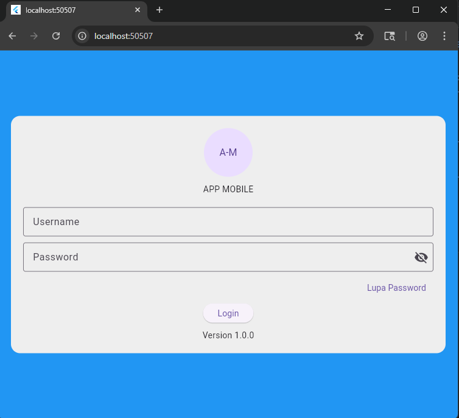
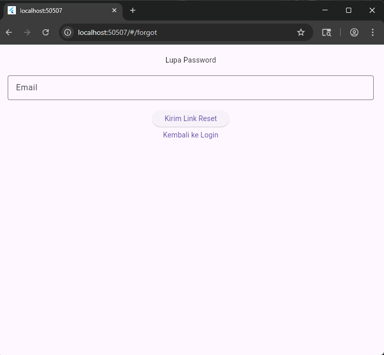
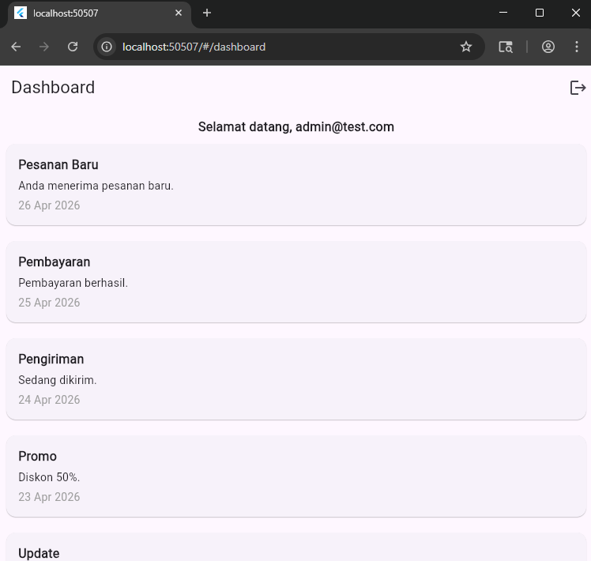

# UTS Flutter - Mobile Programming 

## Deskripsi Aplikasi
APP MOBILE adalah aplikasi berbasis Flutter yang memiliki sistem autentikasi sederhana. 
Pengguna dapat melakukan login menggunakan username dan password, serta mengakses halaman dashboard setelah berhasil masuk.
Aplikasi ini juga menyediakan fitur lupa password untuk mengatur ulang akun, serta menampilkan informasi aktivitas pengguna pada dashboard.

---

## Daftar Fitur
- Halaman Login (username & password)
- Show / Hide password
- Validasi input login
- Fitur Lupa Password (reset via email)
- Navigasi ke halaman reset password
- Dashboard dengan tampilan data dummy
- Tampilan data dummy seperti:
  - Pesanan baru
  - Pembayaran
  - Pengiriman
  - Promo
  - Update
  - Notifikasi
  - Akun
  - Keamanan
  - Transaksi
  - informasi Sistem
- Logout sistem

---

## Cara Menjalankan Aplikasi
1. Clone repository flutter ini
2. Masuk ke folder project: cd appmobile
3. Install dependencies dengan cara: flutter pub get
4. Jalankan aplikasi: flutter run

Berikut screenshot halaman login:

Berikut screenshot halaman lupa password:

Berikut screenshot halaman dashboard:

